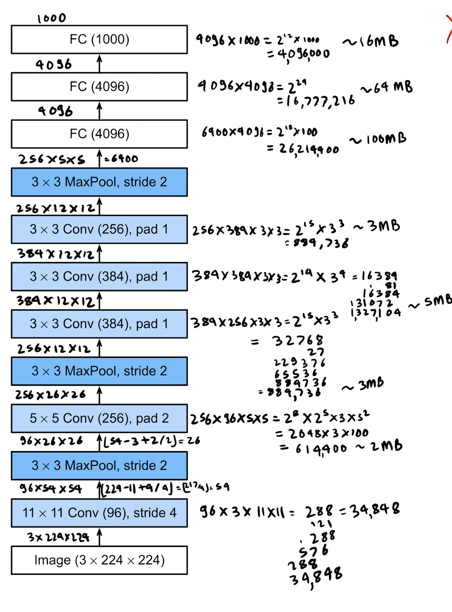

# Calculating parameters in AlexNet

```
conv1: (11*11)*3*96 + 96 = 34944

conv2: (5*5)*96*256 + 256 = 614656

conv3: (3*3)*256*384 + 384 = 885120

conv4: (3*3)*384*384 + 384 = 1327488

conv5: (3*3)*384*256 + 256 = 884992

fc1: (5*5)*256*4096 + 4096 = 26218496

fc2: 4096*4096 + 4096 = 16781312

fc3: 4096*1000 + 1000 = 4097000
```

This results in a total number of 50844008 parameters.

Manual Calculation 
